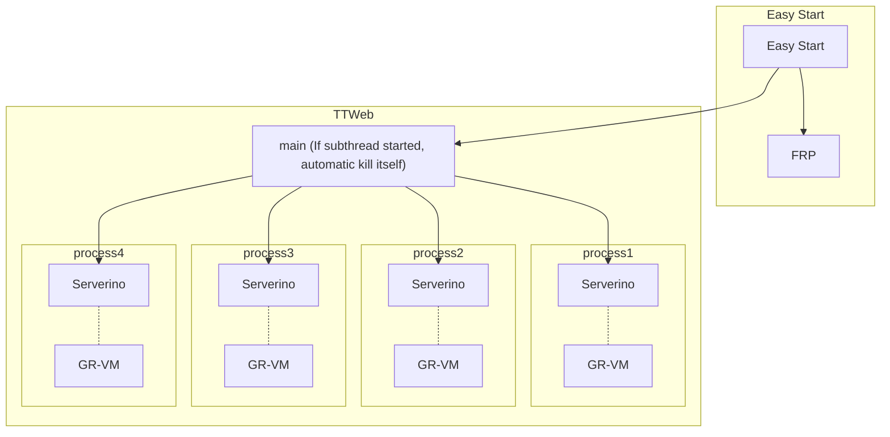
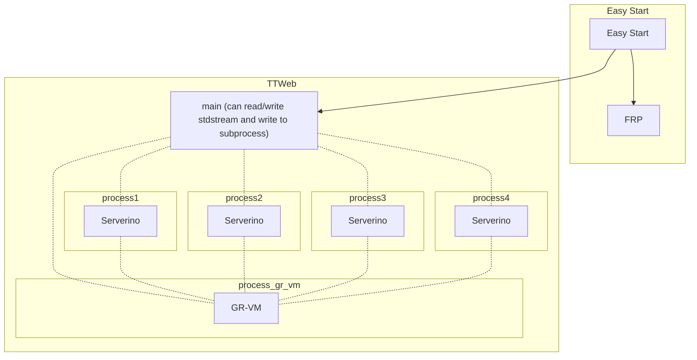

# Tiny Tiny Web
A project for Dlang. It can help you create a web server easily.

[docs(Chinese)](https://duoduo70.github.io/Tiny-Tiny-Web/)

### Prospect:

##### Now:

##### Future:

### Upstream

[serverino](https://github.com/trikko/serverino)

[grimoire](https://github.com/Enalye/grimoire)