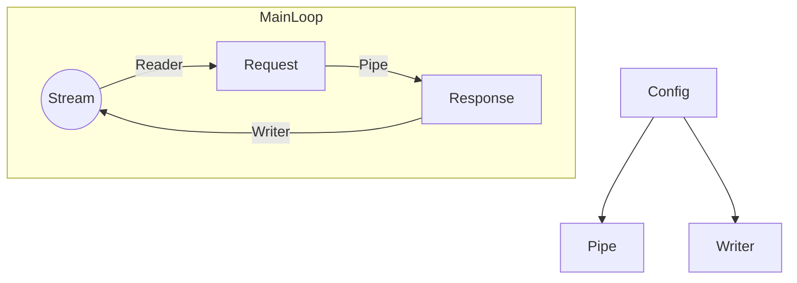

# Tiny Tiny Web 2
Power by rust.
All platforms.

Lightweight web server creater.

### About
This is a scalable web server that helps people create website easily.
Tailor-made software development using Ghost Lisp programming language.

Ghost Lisp is a strong-type DSL.

### Architecture

### Build
By default, the Nightly version will be compiled。
If you want to get stable version, please use `cargo build --features stable`

### Thanks
Thank for all.
Enjoy.