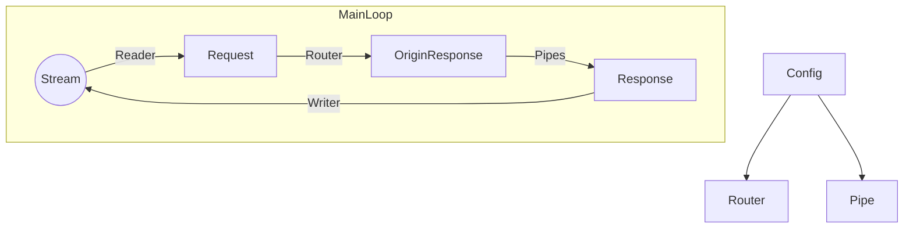

# Tiny Tiny Web 2
Power by rust.
All platforms.  
基于 Rust， 全平台。

Lightweight web server creater.  
轻松创建 Web 服务器。

### About / 关于本项目
This is a scalable web server that helps people create website easily.
Tailor-made software development using Ghost Lisp programming language.  
本项目致力于轻松的创建 Web 服务器。
二次开发使用一种名为 Ghost Lisp 的语言。

Ghost Lisp is a strong-type DSL.  
Ghost Lisp 是一种强类型的专用语言。

### Architecture / 架构设计


### Build / 如何构建
Install Rust, after that, in your program root directory:  
下载 Rust，在此之后，在程序根目录中执行：
```sh
cargo build
```

If you want to build nightly version, use:
如果你希望构建开发版本（Nightly版本），使用：
```sh
cargo build --features nightly
```
WARNING: Now, the Nightly version is absolutely unusable, and the only possible use for building the Nightly version is to contribute to the writing of this project.
警告：现在，Nightly 版本绝对无法正常使用，构建 Nightly 版本的唯一可能用途是为本项目的编写做出贡献。

If you want to build no-glisp version, use:  
如果你希望构建不包含 GLisp 的版本，使用：
```sh
cargo build --features no-glisp
```

There is a shell script to publish release package. Include Linux version, Windows version, Glisp Example, Docs and so on. Generally there is no need to use it.  
有一个可以生成用来发布的包的构建脚本，包含 Linux 版，Windows 版，Glisp 示例，文档等。一般不需要使用。
```sh
# In Linux and your system must include `zip`
sh ./build.sh
```

## Start / 启动
Create `config` , `export` , `temp` directory in your program root directory.
Create `main.gc` in `config` directory, and write:  
在你的程序根目录创建 `config` , `export` , `temp` 文件夹。
然后，在 `config` 文件夹内创建 `main.gc` 并写入：
```
$ +addr 127.0.0.1:22397
+ index.html /
```
After that, create `index.html` in `export` directory, and write:  
在此之后，在 `export` 文件夹内创建 `index.html` 并写入：
```
Hello, World!
```
Start the program, and open `http://127.0.0.1:22397/` in your browser, you should be able to see:  
运行本程序，然后在你的浏览器中打开 `http://127.0.0.1:22397/` ，你应该能够看到：
```
Hello, World!
```

You can install "Ghost Lisp" VSCode extension in VSCode extension market to program with GLisp easily.  
你可以在 VSCode 扩展商店 下载 "Ghost Lisp" 扩展来让编写 Glisp 程序更简单。

### Document / 文档
[User document / 用户文档](https://github.com/duoduo70/Tiny-Tiny-Web/blob/master/docs/index.md)

You can use `cargo doc` to build project document (Unlike the user document, it makes you to understand the code of this project and it contains the development specifications of this project)  
你可以使用 `cargo doc` 命令来构建项目文档（和用户文档不同的是，它让你理解本项目的代码以及它包含了本项目的开发规范）

### Benchmark / 性能测试
Test environment: ArchLinux 2024/3/6, Linux 6.7.1-zen1-1-zen, AMD R5 4500U, Mem DDR3 1333mhz.  
In Benchmark's 1k concurrent test, Apache Httpd is 28483 RPS and ttweb (box-mode) is 42782 RPS. This test result shows that the performance is relatively excellent in the usage scenarios of this project.

测试环境：ArchLinux 2024/3/6 ，Linux 6.7.1-zen1-1-zen ，AMD R5 4500U ，Mem DDR3 1333mhz。  
在 Benchmark 的 1k 并发测试中，Apache Httpd 为 28483 RPS，ttweb (box-mode) 为 42782 RPS 。该测试结果说明在本项目的使用场景中性能表现较为优秀。

### Operating System Support / 操作系统支持

Since I use Linux daily, this project is mainly developed based on Linux.  
In Windows, due to the particularity of its thread implementation, box-mode cannot be used normally. But if you understand high-concurrency programming under Windows, you can contribute to this project.  
It should compile to all platforms that include the Rust standard library, but box mode may not work properly.  
I wrote a Rust translation layer for the PlantOS micro operating system, which should allow this program to run on any i386 device. For details, see [ttweb documentation on PlantOS](https://github.com/duoduo70/Tiny-Tiny-Web/blob/master/docs/plantos.md)

由于我日常使用 Linux ，所以本项目主要基于 Linux 开发。  
在 Windows 中，由于其线程实现的特殊性，box-mode 无法正常使用。但如果你了解 Windows 下的高并发编程，可以为本项目做出贡献。  
它应该可以被编译到所有包含 Rust 标准库的平台上，但 box-mode 可能无法正常使用。  
我为 PlantOS 微型操作系统编写了 Rust 转译层，这使得本程序应该可以跑在任意 i386 设备上，具体请参见 [PlantOS 上的 ttweb 文档](https://github.com/duoduo70/Tiny-Tiny-Web/blob/master/docs/plantos.md)

### Thanks / 致谢
Thanks to Acbox for helping me translate and proofread a (part of) the English document.  
感谢 [Acbox](https://github.com/sheepbox8646) 帮我翻译和校对了（部分）英文版文档。

### (DONT NEED ENGLISH) / 后日谈

(DONT NEED ENGLISH)

今天写下了 ttweb 本体的可能是最后一次正式更新，增加了部分中文支持——我已无力让其完美——以后最多是加一点 GMark 功能。GMark 加了动态生成 Viz-js 2.x 矢量图的支持——以后的 Blog 大概会画很多很复杂的图，算是未雨绸缪了——将来的很长一段时间估计都不会怎么编程了，而是去做一些你们绝对看不懂的领域——我大概会在 https://neospeaking.blogspot.com/ 上更新博客，自娱自乐。从此以后更新随缘。TODO 还是那么多，却没有人来完成它们——我已经没了当初那种动力——哈，多少的童年往事，只不过愿打愿挨。我曾和一个人说过，我们终将要分别——那是半年前——他当时几乎是眼含热泪的对我说，盼望那分别能来的迟些——可最后是他主动离开的。仅仅一年，我和曾经相谈甚欢的所有人都早已行同陌路了。当然，或许是我自作多情了——但是，如果你看到这里，那大概就不是这样的了。从此以后，我便彻底孤身一人了，我是属于上一个时代的，我会脱离新时代的一切—— ttweb 最初那幼稚的宏大设想也是想让我能够在这历史的浪潮中独善其身，至少不要受未来无数 1GB 存储占用的软件和 100+Mbps 的带宽占用的网站所困扰。我成功了，ttweb 已经做到了很多，更重要的是在开发它的过程中我收获了很多，于是它的“历史使命”就完成了。今天的风很温暖，融化了灰青色的 Plasma ，让我们相忘于这风中吧。  
2024 年 5 月 22 日 深夜

Enjoy.