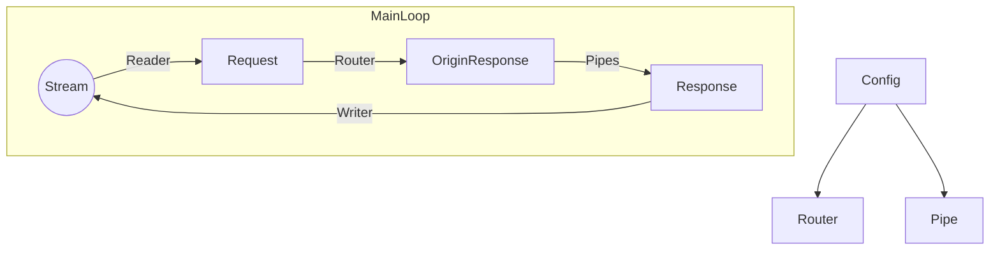

# Tiny Tiny Web 2
Power by rust.
All platforms.  
基于 Rust， 全平台。

Lightweight web server creater.  
轻松创建 Web 服务器。

### About / 关于本项目
This is a scalable web server that helps people create website easily.
Tailor-made software development using Ghost Lisp programming language.  
本项目致力于轻松的创建 Web 服务器。
二次开发使用一种名为 Ghost Lisp 的语言。

Ghost Lisp is a strong-type DSL.  
Ghost Lisp 是一种强类型的专用语言。

### Architecture / 架构设计


### Build / 如何构建
Install Rust, after that, in your program root directory:  
下载 Rust，在此之后，在程序根目录中执行：
```sh
cargo build
```

If you want to build nightly version, use:
如果你希望构建开发版本（Nightly版本），使用：
```sh
cargo build --features nightly
```

If you want to build no-glisp version, use:  
如果你希望构建不包含 GLisp 的版本，使用：
```sh
cargo build --features no-glisp
```

## Start / 启动
Create `config` , `export` , `temp` directory in your program root directory.
Create `main.gc` in `config` directory, and write:  
在你的程序根目录创建 `config` , `export` , `temp` 文件夹。
然后，在 `config` 文件夹内创建 `main.gc` 并写入：
```
$ +addr 127.0.0.1:22397
+ index.html /
```
After that, create `index.html` in `export` directory, and write:  
在此之后，在 `export` 文件夹内创建 `index.html` 并写入：
```
Hello, World!
```
Start the program, and open `http://127.0.0.1:22397/` in your browser, you should be able to see:  
运行本程序，然后在你的浏览器中打开 `http://127.0.0.1:22397/` ，你应该能够看到：
```
Hello, World!
```

### Document / 文档
[Chinese / 中文](https://github.com/duoduo70/Tiny-Tiny-Web/blob/master/docs/index.md)

### Thanks / 致谢
Thank for all.
Enjoy.  
感谢你们所有人。