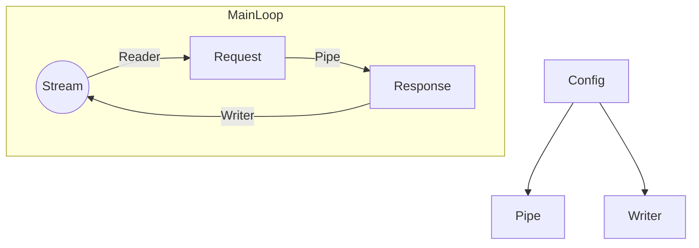

# Tiny Tiny Web 2
Power by rust.
All platforms.

Lightweight web server creater.

### About
This is a scalable web server that helps people create website easily.
Tailor-made software development using Ghost Lisp programming language.

Ghost Lisp is a strong-type DSL.

### Architecture


### Build
By default, the Nightly version will be compiled。
If you want to get stable version, please use `cargo build --features stable`

## Start
Create `config` , `export` , `temp` directory in your program root directory.
Create `main.gc` in `config` directory, and write:
```
$ +addr 127.0.0.1:22397
+ index.html /
```
After that, create `index.html` in `export` directory, and write:
```
Hello, World!
```
Start the program, and open `http://127.0.0.1:22397/` in your browser, you should be able to see:
```
Hello, World!
```

### Document
[Chinese](https://github.com/duoduo70/Tiny-Tiny-Web/blob/master/docs/index.md)

### Thanks
Thank for all.
Enjoy.