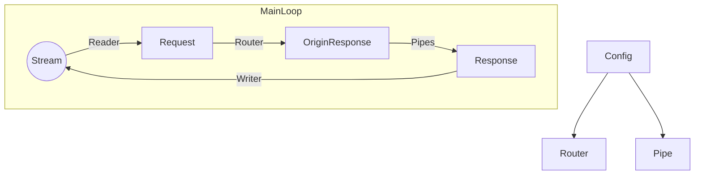

# Tiny Tiny Web 2 临时文档
这是一个用以简单创建Web服务器的软件，使用 Rust 语言开发， GPLv3 开源，以下简称 TTWeb 。

本文档所述内容可能不适合最新版本或对于最新版本而言不全面。
当前文档基于版本 2.0.0-beta3。

对于二次开发所使用的 Ghost Lisp 语言，以下简称 Glisp 。

本文档可以选择 CC-BY-SA 或 GFDL 协议。

## 开始使用：
首先，在程序根目录下创建文件夹：config、export、temp。

用处：
1. config：存放程序的配置文件
2. export：存放网页的源代码
3. temp：存放临时文件

然后，在config目录下创建 main.gc 文件，配置文件的读取从这里开始。

在 main.gc 文件中写入如下内容：
```
$ +addr 127.0.0.1:22397
+ index.html /
```
然后，在 export 文件下创建 index.html 文件
在里面写入如下内容：
```
Hello, World!
```
然后启动程序，在浏览器内打开 http://127.0.0.1:22397/
如果一切顺利，你应该会看到打印：
```
Hello, World!
```

## 所有指令

```
# 挂载一个文件到一个URL,后两个选项是可选的，如果要挂载到根路径，应该使用“/”
+ index.html index.html text/html;charset=utf-8 

# 删除一个URL，这个示例删除了对 index.html 路径的绑定，但是并没有删除 index.html 文件
- index.html

# 添加一个监听地址
$ +addr 127.0.0.1:80
$ +addr [fe80::1]:80

# 设置一个 404 页面，当请求的网页不存在时返回给浏览器这个页面
$ 404page 404.html

# 导入并加载一个配置文件
@ a.gc

# 导入并加载一个 GLisp 配置文件 (如果 GLisp 模块 被编译)
@gl a.gl

# 导入一个 Pipe 待用
@pipe pipe.gl
```
```
# 以下全部是对一个内部变量进行设置，且全部都展示了默认设置
# 在所有涉及小数的配置中，最多使用三位小数

# 设置是否使用本地时间而非世界标准时间
$ localtime yes

# 是否开启 Debug 模式，这会产生更详细的日志输出，但会大幅拖慢程序运行
$ debug no

# 设置程序将以多少线程运行，在 box-mode 中该选项也会影响一些算法细节
$ threads 2

# 配置是否使用 box-mode
# box-mode可以时程序吞吐量大幅提升，但代价是 CPU 会一直全速运转
# 因为 Windows 系统本身的问题，这在 Windows 上会有严重的副作用，或必须使用特殊设置
# Linux 或类似操作系统应该可以正常使用
$ box-mode no

# 这些变量设置 box-mode 的一些算法细节
$ xrps-counter-cache-size 8
$ box-num-per-thread-mag 1.0
$ box-num-per-thread-init-mag 1.0
$ xrps-predict-mag 1.1

# 如果一个请求要被输入 Pipe ，且该 Pipe 出现错误，是否以直接结束当前请求代替默认设置
# 默认设置：返回没有输入该错误管道的原始数据（仅仅是当前错误管道，而非全部管道）
$ return-if-pipe-err no

# 编译一个文件，与下面的加载命令要一起使用，对于要替换的位置，使用 $_gcflag 占位符
compile contents.html
# 注入一个文件（用 a.txt, b.txt, c.txt 中的内容替换 contents.html 中的 $_gcflag 占位符）
inject contents.html a.txt b.txt c.txt
```

## 基于架构来理解 Inject 和 Pipe 的不同及如何使用



### Inject 的使用
在目前的版本中，Inject 是在 Router 中被运作的，但在未来的版本中，何时进行 Inject 会变得可以配置。

也就是说，我们有如下例子：
```
compile template.html
+ template.html a
inject a index.html
```
可以从这个配置文件中得知，我们编译了 `template.html` 这个模板，然后将其挂在到 `a` 这个 URI 上，最后挂载：一旦我们请求 `a` ，它就会将 `index.html` 注入进 a 。
这里的 `template.html` 和 `a` 可以理解为指代不同的资源，在收到请求时，我们先复制一份 `template.html` ，将这个克隆体称为 `a` ，然后再将 `index.html` 注入 `a` 这个克隆体。
最终，我们返回 `a` 。
但是要注意，这个说法只是为了方便理解，实现上做了一些优化。
在以后的版本中，会添加一种新的语法声明如果`a`被构造过一次，将会直接从内存中拿取它，而非重新构造。

此时，`a` 便是上述架构图中的 `OriginResponse` 。

假设 `template.html` 文件中有：
```
a $_gcflag c
```
而 `index.html` 中有：
```
b
```
那么 `OriginResponse` 是：
```
a b c
```
由于它是被单独实现和优化的，它比用 Pipe 来执行替换快很多。

### Pipe 的使用
我们得到了 `OriginResponse` 之后，如果想要对它进行特殊的处理，可以使用 Pipe 。
我们在一个 Pipe 配置中写入如下内容：
```scheme
(do
    (str.+ CONTENT (str "\bd"))
)
```
它会将 `a b c` 处理为 `a b c d`

## 如何编写 Glisp 配置文件和 Pipe

Glisp 是一门基于 Lisp 的编程语言。
在 Glisp 编程语言中，不存在陈述式（Statment），只存在表达式（Expression），换句话说，每一个式子都有返回值，并且没有诸如 `((set n 1)(+ n 1))`或类似的写法。
每一个表达式都遵循如下语法：
```scheme
(func)
; 或
(func arg1 arg2 ...)
```

表达式的概念类似其它大多数编程语言，是嵌套的。
```
(+ (+ 1 2) 1)
```
在最高的层面看，此为一个表达式。`+`函数传入了两个表达式。递归的看，它有很多子表达式，要注意的是一般认为一个表达式本身也是它自己的子表达式。

这也就是说，如果你需要按照顺序执行多个表达式，必须使用一个函数将表达式捆起来，通常使用 `do` 函数，该函数并不起其它 Lisp 语言中常见的“循环”作用，而是起“顺序执行”作用，系统提供的循环函数是`loop`：
```scheme
(do
    (log "1")
    (log "2")
    (+ 1 1)
)
```
`do`函数的返回值是其最后一个参数被解析后的返回值，例如这个例子中返回 `2`
`被解析`和`函数执行`是两个类似但不相同的概念，偶尔可能会混用。例如`1`在被解析后返回`1`，但你不能说将`1`看作一个函数执行，因为它是一个字面量。
字面量可以被解析为表达式，但是不能被解析为函数。
例如上面的例子也可以修改成：
```scheme
(do
    (log "1")
    (log "2")
    2
)
```
事实上在绝大多数情况下我们并不要求参数必须是一个函数，它只要能被正确“解析”（eval）即可。
因为 GLisp 有这样复杂的特性，即使其底层是强类型的，但在大多数情况下，我们不用太关注“类型”这个概念，相反，我们应该关注表达式本身。
例如，我们虽然可以限制一个函数比如传入 Number 类型，但是高级函数往往需要传入一个表达式本身，从而对表达式本身进行操作，这类似于 `Rust` 语言的“过程宏”。
函数执行通常是以它的所有参数都被解析为前提的，例如如下表达式：
```scheme
(+ (+ 1 (+ 2 3)) (+ 2 1))
```
经过几次解析，它会被解析成：
```scheme
(+ 6 3)
```
此时，我们才能“执行”最外层的函数。函数只能执行一次。
在此次执行后，它返回`9`。

同理，我们有`loop`函数：
```scheme
(loop
    (func1)
    (func2)
    (func3)
    (return)
)
```
如果其中的一个表达式被解析后返回`return`，则退出循环。
如果其中的一个表达式被解析后返回`continue`，则重新循环。
所以，为什么这里的 `return` 要写作 `(return)` ？很简单，因为在 `loop` 函数的机制中欧，它的每个函数在每次循环中都要被解析一次。
不加括号的 `return` 是单纯的符号 (Symbol) ，所以无法被解析。（数字能被解析是因为数字的底层类型是 Number ，但符号不行，符号只能被括号括住作为函数被解析，但是如果一个高级函数不解析它的传入参数，则可以传入不加括号的符号。）
在被解析一次之后，它返回作为符号的 `return` （默认来说，一个表达式只会被“完全解析”一次，而非“循环完全解析”，也就是说，例如`(+ (+ 1 1) (+ 1 1))`这种函数，在一次完全解析后得到 `1` ，它不会再对 `1` 做解析，否则会产生无限循环）。

同理，有 `if` 函数，我们配合 `loop` 函数来使用：
```scheme
(do
    (set i 0)
    (loop
        (if (> i 10)
            (return)
            (pass)
        )
        (set i (+ i 1))
    )
)
```
这个表达式会返回 `return` 而非 `11` ，如果我们要返回 `11` 的话我们应该这样更改：
```scheme
(do
    (set i 0)
    (loop
        (if (> i 10)
            (return)
            (pass)
        )
        (set i (+ i 1))
    )
    i
)
```

对于查看最新的所有的内置函数，应该查看[源代码存储库](https://github.com/duoduo70/Tiny-Tiny-Web)中的`src/glisp/std/mod.rs`文件（最好是你当前使用的 TTWeb 版本的拷贝而不是 Github 上的主分支），亦或者，这里有一份`2.0.0-beta3`版本的拷贝，它可能已经过时：
```rust
/* Tiny Tiny Web
 * Copyright (C) 2024 Plasma (https://github.com/duoduo70/Tiny-Tiny-Web/).
 *
 * You should have received a copy of the GNU General Public License
 * along with this program;
 * if not, see <https://www.gnu.org/licenses/>.
 */

mod core;
mod str;
mod macros;
mod io;
mod eval;

use super::core::*;
use core::*;
use str::*;
use io::*;
use eval::*;

pub fn eval_built_in_form(
    exp: &Expression,
    other_args: &[Expression],
    env: &mut Environment,
) -> Option<Result<Expression, GError>> {
    match exp {
        Expression::Symbol(symbol) => match symbol.as_ref() {
            "if" => Some(func_if(other_args, env)),
            "set" => Some(func_set(other_args, env)),
            "lambda" => Some(func_lambda(other_args)),
            "quote" => Some(func_quote(other_args)),
            "atom" => Some(func_atom(other_args, env)),
            "eq" => Some(func_eq(other_args, env)),
            "car" => Some(func_car(other_args, env)),
            "cdr" => Some(func_cdr(other_args, env)),
            "cons" => Some(func_cons(other_args)),
            "cond" => Some(func_cond(other_args, env)),
            "length" => Some(func_length(other_args, env)),
            "str.=" => Some(func_str_eq(other_args, env)),
            "str.!=" => Some(func_str_ne(other_args, env)),
            "str.<" => Some(func_str_lt(other_args, env)),
            "str.<=" => Some(func_str_le(other_args, env)),
            "str.>" => Some(func_str_gt(other_args, env)),
            "str.>=" => Some(func_str_ge(other_args, env)),
            "last" => Some(func_last(other_args, env)),
            "chars" => Some(func_chars(other_args, env)),
            "find" => Some(func_find(other_args, env)),
            "contains" => Some(func_contains(other_args, env)),
            "insert" => Some(func_insert(other_args, env)),
            "begin" => Some(func_begin(other_args, env)),
            "is-empty" => Some(func_is_empty(other_args, env)),
            "remove" => Some(func_remove(other_args, env)),
            "reverse" => Some(func_reverse(other_args, env)),
            "rfind" => Some(func_rfind(other_args, env)),
            "slice" => Some(func_slice(other_args, env)),
            "log" => Some(func_console_log(other_args, env)),
            "loop" => Some(func_loop(other_args, env)),
            "read-file" => Some(func_read_file(other_args, env)),
            "write-file" => Some(func_write_file(other_args, env)),
            "do" => Some(func_do(other_args, env)),
            "meta" => Some(func_meta(other_args, env)),
            "eval-atom" => Some(func_eval_atom(other_args, env)),
            "str" => Some(func_str(other_args, env)),
            "str.+" => Some(func_str_plus(other_args, env)),
            "or" => Some(func_or(other_args, env)),
            "and" => Some(func_and(other_args, env)),
            "lines" => Some(func_lines(other_args, env)),
            "return" => Some(Ok(Expression::Symbol("return".to_owned()))),
            "continue" => Some(Ok(Expression::Symbol("continue".to_owned()))),
            "pass" => Some(Ok(Expression::Symbol("pass".to_owned()))),
            "read-dir" => Some(func_read_dir(other_args, env)),
            "for-each-eval" => Some(func_for_each_eval(other_args, env)),
            "eval" => Some(func_eval(other_args, env)),
            "run" => Some(func_run(other_args, env)),
            _ => None,
        },
        _ => None,
    }
}
```
目前还没有实现函数签名和文档注释，所以你或许要查看源代码来了解函数的用法。

或者，有一个用 Glisp 实现的 Markdown 编译器：
```scheme
;;; Tiny Tiny Web
;;; Copyright (C) 2024 Plasma (https://github.com/duoduo70/Tiny-Tiny-Web/).
;;;
;;; You should have received a copy of the GNU General Public License
;;; along with this program;
;;; if not, see <https://www.gnu.org/licenses/>.
;;;
(do

    (set markdown-parse-line 
        (lambda 
            (str)
            (do
            (set str-length (length str))
                (if 
                    (str.= 
                        (slice str 0 0) "#") 
                    (if 
                        (str.= 
                            (slice str 1 1) "#") 
                        (if 
                            (str.= 
                                (slice str 2 2) "#") 
                            (if 
                                (str.= 
                                    (slice str 3 3) "#") 
                                (if 
                                    (str.= 
                                        (slice str 4 4) "#") 
                                    (set str (str.+ 
                                        (insert 
                                            (remove str 0 5) 0 "<h5>") "</h5>") )
                                    (set str (str.+ 
                                        (insert 
                                            (remove str 0 4) 0 "<h4>") "</h4>")) )
                               (set str (str.+ 
                                    (insert 
                                        (remove str 0 3) 0 "<h3>") "</h3>")) )
                            (set str (str.+ 
                                (insert 
                                    (remove str 0 2) 0 "<h2>") "</h2>")) )
                        (set str (str.+ 
                            (insert 
                                (remove str 0 1) 0 "<h1>") "</h1>")) )
                    (if 
                        (str.= 
                            (slice str 
                                (- 
                                    str-length 2)
                                (- 
                                    str-length 1)) 
                            (str "\b\b")) 
                        (set str (str.+ str (str "<br\b/>"))) (pass)))
    (set str-length (length str))
    (set strong-flag false)
    (set italic-flag false)
    (set str (str.+ str "\n"))
    (set i 0)
    (loop
    (if (>= i str-length) (return) (pass))
    (set str-field (slice str i (+ i 1)))
    (if (str.= str-field "**")
        (if strong-flag (if italic-flag (pass) (do
            (set strong-flag false)
            (set str (remove str i (+ i 1)))
            (set str (insert str i "</strong>"))
            (set str-length (+ str-length 7))
            (set i (+ i 8)))
        ) (do
            (set strong-flag true)
            (set str (remove str i (+ i 1)))
            (set str (insert str i "<strong>"))
            (set str-length (+ str-length 6))
            (set i (+ i 7))
        ))
     (pass))
    (if (str.= str-field "__")
        (if strong-flag (if italic-flag (pass) (do
            (set strong-flag false)
            (set str (remove str i (+ i 1)))
            (set str (insert str i "</strong>"))
            (set str-length (+ str-length 7))
            (set i (+ i 8)))
        ) (do
            (set strong-flag true)
            (set str (remove str i (+ i 1)))
            (set str (insert str i "<strong>"))
            (set str-length (+ str-length 6))
            (set i (+ i 7))
        ))
     (pass))
     (if (str.= (slice str i i) "*")
        (if italic-flag (do
            (set italic-flag false)
            (set str (remove str i))
            (set str (insert str i "</em>"))
            (set str-length (+ str-length 4))
            (set i (+ i 3))
        ) (do
            (set italic-flag true)
            (set str (remove str i))
            (set str (insert str i "<em>"))
            (set str-length (+ str-length 3))
            (set i (+ i 2))
        ))
     (pass))
     (if (str.= (slice str i i) "_")
        (if italic-flag (do
            (set italic-flag false)
            (set str (remove str i))
            (set str (insert str i "</em>"))
            (set str-length (+ str-length 4))
            (set i (+ i 3))
        ) (do
            (set italic-flag true)
            (set str (remove str i))
            (set str (insert str i "<em>"))
            (set str-length (+ str-length 3))
            (set i (+ i 2))
        ))
     (pass))
    (set i (+ i 1))
    )
    str
)
))

    (set markdown-parse
        (lambda 
            (str) 
            (do
                (set flag_part false)
                (set flag_part_start true)
                (set flag_linelist false)
                (set flag-codeblock false)
                (set flag-dontparse false)

                (set head 0)
                (set ret "")
                (loop
                    (if 
                        (= 0 
                            (length str)) 
                        (return) 0)
                    (set head 
                        (car str))
                    (set str 
                        (cdr str))

                    (if 
                        (and (> (length head) 2) (str.= (slice head 0 2) "```"))
                        (do (if (= (length head) 3) (if flag-codeblock               
                                (do
                                    (set flag-codeblock true)
                                    (set ret 
                                        (str.+ ret  (str "</code></pre>\n")))
                                    (if flag_part (do
                                        (set ret 
                                        (str.+ ret  (str "</p>\n")))
                                        (set falg_part false)
                                    ) (pass))
                                )
                                (do
                                    (set flag-codeblock false)
                                    (if flag_part (do
                                        (set ret 
                                        (str.+ ret  (str "</p>\n")))
                                        (set falg_part false)
                                    ) (pass))
                                    (set ret 
                                        (str.+ ret  (str "<pre><code>\n")))
                                )
                            )
                            (do                                            
                                (set flag-codeblock true)
                                (if flag_part (do
                                        (set ret 
                                        (str.+ ret  (str "</p>\n")))
                                        (set falg_part false)
                                    ) (pass))
                                (set ret
                                    (str.+ (str.+ (str.+ ret (str "<pre><code\bclass=\'language-"))
                                        (slice head 3 (- (length head) 1))
                                    )
                                        (str "\'>\n")
                                    )
                                )
                            )
                        )
                        (continue))
                    0)

                    (if 
                        (and (> (length head) 6) (str.= (slice head 0 6) "<style>"))
                        (do
                            (if flag_part (do
                                        (set ret 
                                        (str.+ ret  (str "</p>\n")))
                                        (set falg_part false)
                                    ) (pass))
                            (set ret 
                                        (str.+ ret  (str "<style>\n")))
                            (set flag-dontparse true)
                            (continue)
                        )
                    0)
                    (if 
                        (and (> (length head) 7) (str.= (slice head 0 7) "</style>"))
                        (do
                            (set flag-dontparse false)
                            (set ret 
                                        (str.+ ret  (str "</style>\n")))
                            (continue)
                        )
                    0)
                    (if 
                        (= (length head) 0) 
                        (do
                            (if flag_linelist (do
                                (set flag_linelist false)
                                (set ret (str.+ ret "</ul>"))
                                (if flag_part (set flag_part false) 0)
                            )(pass))
                        (if 
                            (and (= flag_part false) (= flag-dontparse false))
                            (do 
                                (set ret 
                                    (str.+ ret 
                                        (if flag_part_start 
                                            (do 
                                                (set flag_part_start false) "<p>\n" ) "</p><p>\n")))
                                (set flag_part true)
                                (continue)) 0)
                        )
                    (pass))

                    (if 
                            (= flag_part true) 
                            (set flag_part false) 0)

                    (if (and (> (length head) 1)(and (str.= (slice head 0 0) "-") (str.!= (slice head 1 1) "-"))) (do
                        (if flag_linelist 
                            (set ret (str.+ ret "</li><li>"))
                             (do 
                                 (set flag_linelist true)
                                 (set ret (str.+ ret "<ul><li>"))
                             )
                        )
                        (set head (remove head 0))
                        )
                    (pass))
                    (if 
                        (str.= head "---") 
                        (do
                            (if flag_part (do
                                        (set ret 
                                        (str.+ ret  (str "</p>\n")))
                                    ) (pass))
                            (set ret 
                                (str.+ ret  (str "<hr\b/>\n")))
                            (if flag_part (do
                                        (set ret 
                                        (str.+ ret  (str "<p>\n")))
                                    ) (pass))
                            (continue) )0)
                    (if (or (= (length head) 0) (= flag-dontparse true))
                        (set ret 
                                (str.+ ret 
                                    head))
                        (set ret 
                                (str.+ ret 
                                    (markdown-parse-line head))))
)
    (if flag_part_start 0 
        (set ret 
            (str.+ ret 
            "</p>")))
    (set ret-length (length ret))
    (if (str.= (slice ret (- ret-length 9) (- ret-length 1)) "<p>\n</p>") 
        (set ret (remove ret (- ret-length 9) (- ret-length 1)))
     (pass))
    ret
)
)
)

    (for-each-eval (read-dir "markdown") 
        (str "\[write-file\b\'temp/$$.html\'\b\[str\b\[markdown-parse\b\[lines\b\[read-file\b\'markdown/$$\'\]\]\]\]\]")
    )
)
```
这个程序的作用是读取所有 `markdown/*.md` 文件，将其编译到 `temp/*.md.html`。

## 其它

如果你发现了一个 Bug，欢迎将其报告到[ Github 上的源代码存储库](https://github.com/duoduo70/Tiny-Tiny-Web)。
尽管如此，根据 GPLv3 开源协议，我不对程序的运行做任何担保，换句话说，我不保证一定会修复 Bug 。

欢迎你对程序进行更改，你可以创建一个拉取请求（Pull Request）来合并你对程序的更改到本项目。

欢迎你提交你编写的 Demo 以为后来的用户展示及作学习参考之用。

欢迎你翻译本项目到其它语言，请不要硬编码（简单的把英文文本替换成其它语言文本）的翻译本项目的程序部分，而是应该让用户选择他想要使用的语言，然后把你的翻译做为拉取请求来提交。