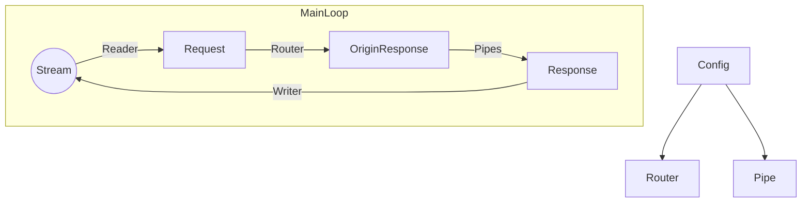

# Tiny Tiny Web 2 User Documentation / Tiny Tiny Web 2 用户文档

Tiny-Tiny-Web, A free software that concentrate on rapidly and easily create web server, which use Rust as development language, publish under GPLv3 License. In following texts, we call it TTWeb for short.

这是一个用以简单创建Web服务器的软件，使用 Rust 语言开发， GPLv3 开源，以下简称 TTWeb 。

This version may not approperiately be with the latest version (In other words, it may be not comprehensive)

本文档所述内容可能不适合最新版本或对于最新版本而言不全面。

This version is based on version 2.0.0-beta13

当前文档基于版本 2.0.0-beta13。

% NEED ENGLISH %

即便该文档支持的版本与最新版本相同，也可能有些来不及更新的部分，因为本项目正在快速发展，以及所有文档均由我一人编写。

For the language of twice-development - Ghost Lisp, we call it Glisp for short.

对于二次开发所使用的 Ghost Lisp 语言，以下简称 Glisp 。

This documentation can choice CC_BY_SA or GFDL license

本文档可以选择 CC-BY-SA 或 GFDL 协议。

## Getting start/开始使用：

First of foremost, create `config`, `export`, `temp` in the root of project

首先，在程序根目录下创建文件夹: `config`, `export`, `temp`。

Usage:
1. `config`: Put up the config files of programme
2. `export`: Set up the source code of web pages
3. `temp`: Set up temporary files

用处：
1. `config`：存放程序的配置文件
2. `export`：存放网页的源代码
3. `temp`：存放临时文件

And than, create `main.gc`

然后，在config目录下创建 `main.gc` 文件，配置文件的读取从这里开始。

Write following content in `main.gc`

在 `main.gc` 文件中写入如下内容：
```ghostcode
$ +addr 127.0.0.1:22397
+ index.html /
```

Create `index.html` in `export`, and input following codes:

然后，在 export 文件下创建 index.html 文件，在里面写入如下内容：
```ghostcode
Hello, World!
```
Now, run it and visit `http://127.0.0.1:22397`
If everything is okay, you will see:

然后启动程序，在浏览器内打开 http://127.0.0.1:22397/
如果一切顺利，你应该会看到打印：
```ghostcode
Hello, World!
```

## Command List/指令列表

```ghostcode
# Mount a file to a URL, the latest two option is optional. If Mounting on root, you should use `/`
# 挂载一个文件到一个URL,后两个选项是可选的，如果要挂载到根路径，应该使用`/`
+ index.html index.html text/html;charset=utf-8 

# Delete a URL. In this Instance, we deleted the bounds for `index.html`, but didn't delete the file.
# 删除一个URL，这个示例删除了对 index.html 路径的绑定，但是并没有删除 index.html 文件
- index.html

# Add a listener location
# 添加一个监听地址
$ +addr 127.0.0.1:80
$ +addr [fe80::1]:80

# Setup a error page based on error code. Currently, we can only setup 404 page.
# 设置一个错误页面，随错误码返回，目前仅支持 404
$ +errpage 404 404.html

# Import and load a config file
# 导入并加载一个配置文件
@ a.gc

# Import and load a Glisp config file (If the module has been compiled)
# 导入并加载一个 GLisp 配置文件 (如果 GLisp 模块 被编译)
@gl a.gl

# Import a Pipe to await a using
# 导入一个 Pipe 待用
@pipe pipe.gl

# Compile a file, which must be used with following loading command. For the position that need replace, use replacing code - `$_gcflag`
# 编译一个文件，与下面的加载命令要一起使用，对于要替换的位置，使用 `$_gcflag` 占位符
compile contents.html

# Inject a file (Use a.txt, b.txt, c.txt to replace `$_gcflag`s in contents.html)
# 注入一个文件（用 a.txt, b.txt, c.txt 中的内容替换 contents.html 中的 $_gcflag 占位符）
inject contents.html a.txt b.txt c.txt

# Even though TTWeb has not support HTTPS, we has coded many, and reserved:
# 虽然本项目还没有准备好支持 HTTPS ，但是已经预先编写了很多代码 ，并且预留了：

# Import a CA certificate of DER
# 导入一个 DER 格式的 CA 证书
$ ssl-certificate ca.der

# Import a private key of DER
# 导入一个 DER 格式的私钥
$ ssl-private-key private_key.der
```
```
# This following command is all for varibale settings, and all shows default config
# 以下全部是对一个内部变量进行设置，且全部都展示了默认设置
# All the config item related to float number, you should use less three unit after point
# 在所有涉及小数的配置中，最多使用三位小数

# Set local time instead of world time priciple
# 设置是否使用本地时间而非世界标准时间
$ localtime yes

# If enable debug mode, it will produce more information but the speed will slow down.
# 是否开启 Debug 模式，这会产生更详细的日志输出，但会大幅拖慢程序运行
$ debug no

# Set the thread amount.
# 设置程序将以多少线程运行，在 box-mode 中该选项也会影响一些算法细节
$ threads 2

# 是否为 GL 解释器启用调试，这会极大影响性能，并且可能不适用于较大的脚本
$ gl-debug no

# 是否为 GL 解释器启用栈相关功能，关闭它可能会优化性能，但程序设计可能会丧失一定灵活性
# 如果希望为调试器启用堆栈跟踪，则不能关闭该功能
$ gl-stack yes

# Weather use box-mode
# 配置是否使用 box-mode
# Box-mode could let the programme throughput, but the CPU would be full
# box-mode可以时程序吞吐量大幅提升，但代价是 CPU 会一直全速运转
# Because of the problem of Windows' self, it would produce a great side effect, must use extra configs.
# 因为 Windows 系统本身的问题，这在 Windows 上会有严重的副作用，或必须使用特殊设置
# Linux can it.
# Linux 或类似操作系统应该可以正常使用
$ box-mode no

# These variables configure some algorithmic details of box-mode
# 这些变量设置 box-mode 的一些算法细节
$ xrps-counter-cache-size 8
$ box-num-per-thread-mag 1.0
$ box-num-per-thread-init-mag 1.0
$ xrps-predict-mag 1.1

# If a request is to be input into Pipe and an error occurs in that Pipe, whether to terminate the current request directly instead of the default setting
# 如果一个请求要被输入 Pipe ，且该 Pipe 出现错误，是否以直接结束当前请求代替默认设置
# Default setting: return the original data that has not been input into the erroneous pipe (just the current erroneous pipe, not all pipes)
# 默认设置：返回没有输入该错误管道的原始数据（仅仅是当前错误管道，而非全部管道）
$ return-if-pipe-err no

# Register a new default MIME type, which will be used automatically based on file extension when mounting files in the future
# 注册一个新的默认 MIME 类型，以后在挂载文件时会根据文件扩展名自动使用注册的 MIME 类型
# Automatically registered types:
# 自动注册的类型：
$ +mime html text/html
$ +mime css text/css
$ +mime js text/html
$ +mime gif image/gif
$ +mime png image/png
$ +mime jpg image/jpeg
$ +mime jpeg image/jpeg
$ +mime webp image/webp
$ +mime svg image/svg+xml

# Enable a status code, which is off by default
# 启用一个状态码，默认皆是关闭状态
# Below are all the statuses that can be enabled, according to the RFC7231 standard
# 以下是所有可以启用的状态，根据 RFC7231 标准
$ +code 400
$ +code 404
```

## 基于架构来理解 Inject 和 Pipe 的不同及如何使用



### Inject 的使用
In current version, Inject is run in Router, but in the future, you can set when to inject.
在目前的版本中，Inject 是在 Router 中被运作的，但在未来的版本中，何时进行 Inject 会变得可以配置。

In other words, we have following example:
也就是说，我们有如下例子：
```ghostcode
compile template.html
+ template.html a
inject a index.html
```
Known from the config file, we compiled `template.html`, and mounted it on URL `a`. As soon as we request `a`, it will inject `index.html` into a.
可以从这个配置文件中得知，我们编译了 `template.html` 这个模板，然后将其挂在到 `a` 这个 URL 上，最后挂载：一旦我们请求 `a` ，它就会将 `index.html` 注入进 a 。
`template.html` and `a` can be understanded as different source. When it get required, we firstly copy a `template.html` and we called it as `a`, and inject `index.html` into `a`, and in the end, we return `a`.
这里的 `template.html` 和 `a` 可以理解为指代不同的资源，在收到请求时，我们先复制一份 `template.html` ，将这个克隆体称为 `a` ，然后再将 `index.html` 注入 `a` 这个克隆体。
最终，我们返回 `a` 。
但是要注意，这个说法只是为了方便理解，实现上做了一些优化。
在以后的版本中，会添加一种新的语法声明如果`a`被构造过一次，将会直接从内存中拿取它，而非重新构造。

此时，`a` 便是上述架构图中的 `OriginResponse` 。

假设 `template.html` 文件中有：
```scheme
a $_gcflag c
```
而 `index.html` 中有：
```scheme
b
```
那么 `OriginResponse` 是：
```scheme
a b c
```
由于它是被单独实现和优化的，它比用 Pipe 来执行替换快很多。

### Pipe 的使用
我们得到了 `OriginResponse` 之后，如果想要对它进行特殊的处理，可以使用 Pipe 。
我们在一个 Pipe 配置中写入如下内容：
```scheme
(do
    (str.+ CONTENT (str "\bd"))
)
```
它会将 `a b c` 处理为 `a b c d`

## 如何编写 Glisp 配置文件和 Pipe

Glisp 是一门基于 Lisp 的编程语言。
在 Glisp 编程语言中，不存在陈述式（Statment），只存在表达式（Expression），换句话说，每一个式子都有返回值，并且没有诸如 `((set n 1)(+ n 1))`或类似的写法。
每一个表达式都遵循如下语法：
```scheme
(func)
; 或
(func arg1 arg2 ...)
```

表达式的概念类似其它大多数编程语言，是嵌套的。
```scheme
(+ (+ 1 2) 1)
```
在最高的层面看，此为一个表达式。`+`函数传入了两个表达式。递归的看，它有很多子表达式，要注意的是一般认为一个表达式本身也是它自己的子表达式。

这也就是说，如果你需要按照顺序执行多个表达式，必须使用一个函数将表达式捆起来，通常使用 `do` 函数，该函数并不起其它 Lisp 语言中常见的“循环”作用，而是起“顺序执行”作用，系统提供的循环函数是`loop`：
```scheme
(do
    (log "1")
    (log "2")
    (+ 1 1)
)
```
`do`函数的返回值是其最后一个参数被解析后的返回值，例如这个例子中返回 `2`
`被解析`和`函数执行`是两个类似但不相同的概念，偶尔可能会混用。例如`1`在被解析后返回`1`，但你不能说将`1`看作一个函数执行，因为它是一个字面量。
字面量可以被解析为表达式，但是不能被解析为函数。
例如上面的例子也可以修改成：
```scheme
(do
    (log "1")
    (log "2")
    2
)
```
事实上在绝大多数情况下我们并不要求参数必须是一个函数，它只要能被正确“解析”（eval）即可。
因为 GLisp 有这样复杂的特性，即使其底层是强类型的，但在大多数情况下，我们不用太关注“类型”这个概念，相反，我们应该关注表达式本身。
例如，我们虽然可以限制一个函数比如传入 Number 类型，但是高级函数往往需要传入一个表达式本身，从而对表达式本身进行操作，这类似于 `Rust` 语言的“过程宏”。
函数执行通常是以它的所有参数都被解析为前提的，例如如下表达式：
```scheme
(+ (+ 1 (+ 2 3)) (+ 2 1))
```
经过几次解析，它会被解析成：
```scheme
(+ 6 3)
```
此时，我们才能“执行”最外层的函数。函数只能执行一次。
在此次执行后，它返回`9`。

同理，我们有`loop`函数：
```scheme
(loop
    (func1)
    (func2)
    (func3)
    (return)
)
```
如果其中的一个表达式被解析后返回`return`，则退出循环。
如果其中的一个表达式被解析后返回`continue`，则重新循环。
所以，为什么这里的 `return` 要写作 `(return)` ？很简单，因为在 `loop` 函数的机制中，它的每个函数在每次循环中都要被解析一次。
不加括号的 `return` 是单纯的符号 (Symbol) ，所以无法被解析。（数字能被解析是因为数字的底层类型是 Number ，但符号不行，符号只能被括号括住作为函数被解析，但是如果一个高级函数不解析它的传入参数，则可以传入不加括号的符号。）
在被解析一次之后，它返回作为符号的 `return` （默认来说，一个表达式只会被“完全解析”一次，而非“循环完全解析”，也就是说，例如`(+ (+ 1 1) (+ 1 1))`这种函数，在一次完全解析后得到 `1` ，它不会再对 `1` 做解析，否则会产生无限循环）。

同理，有 `if` 函数，我们配合 `loop` 函数来使用：
```scheme
(do
    (set i 0)
    (loop
        (if (> i 10)
            (return)
            (pass)
        )
        (set i (+ i 1))
    )
)
```
这个表达式会返回 `return` 而非 `11` ，如果我们要返回 `11` 的话我们应该这样更改：
```scheme
(do
    (set i 0)
    (loop
        (if (> i 10)
            (return)
            (pass)
        )
        (set i (+ i 1))
    )
    i
)
```

对于查看最新的所有的内置函数，应该查看[源代码存储库](https://github.com/duoduo70/Tiny-Tiny-Web)中的`src/glisp/std/mod.rs`文件（最好是你当前使用的 TTWeb 版本的拷贝而不是 Github 上的主分支），亦或者，这里有一份`2.0.0-beta8`版本的拷贝，它可能已经过时：
```rust
/* Tiny Tiny Web
 * Copyright (C) 2024 Plasma (https://github.com/duoduo70/Tiny-Tiny-Web/).
 *
 * You should have received a copy of the GNU General Public License
 * along with this program;
 * if not, see <https://www.gnu.org/licenses/>.
 */

mod config;
mod core;
mod eval;
mod io;
mod macros;
mod str;

use super::core::*;
use config::*;
use core::*;
use eval::*;
use io::*;
use str::*;

pub fn eval_built_in_form(
    exp: &Expression,
    other_args: &[Expression],
    env: &mut Environment,
    config: Config,
) -> Option<Result<Expression, GError>> {
    match exp {
        Expression::Symbol(symbol) => match symbol.as_ref() {
            "if" => Some(func_if(other_args, env, config)),
            "set" => Some(func_set(other_args, env, config)),
            "lambda" => Some(func_lambda(other_args)),
            "quote" => Some(func_quote(other_args)),
            "atom" => Some(func_atom(other_args, env, config)),
            "eq" => Some(func_eq(other_args, env, config)),
            "car" => Some(func_car(other_args, env, config)),
            "cdr" => Some(func_cdr(other_args, env, config)),
            "cons" => Some(func_cons(other_args)),
            "cond" => Some(func_cond(other_args, env, config)),
            "length" => Some(func_length(other_args, env, config)),
            "str.=" => Some(func_str_eq(other_args, env, config)),
            "str.!=" => Some(func_str_ne(other_args, env, config)),
            "str.<" => Some(func_str_lt(other_args, env, config)),
            "str.<=" => Some(func_str_le(other_args, env, config)),
            "str.>" => Some(func_str_gt(other_args, env, config)),
            "str.>=" => Some(func_str_ge(other_args, env, config)),
            "last" => Some(func_last(other_args, env, config)),
            "chars" => Some(func_chars(other_args, env, config)),
            "find" => Some(func_find(other_args, env, config)),
            "contains" => Some(func_contains(other_args, env, config)),
            "insert" => Some(func_insert(other_args, env, config)),
            "begin" => Some(func_begin(other_args, env, config)),
            "is-empty" => Some(func_is_empty(other_args, env, config)),
            "remove" => Some(func_remove(other_args, env, config)),
            "reverse" => Some(func_reverse(other_args, env, config)),
            "rfind" => Some(func_rfind(other_args, env, config)),
            "slice" => Some(func_slice(other_args, env, config)),
            "log" => Some(func_console_log(other_args, env, config)),
            "loop" => Some(func_loop(other_args, env, config)),
            "read-file" => Some(func_read_file(other_args, env, config)),
            "write-file" => Some(func_write_file(other_args, env, config)),
            "do" => Some(func_do(other_args, env, config)),
            "meta" => Some(func_meta(other_args, env, config)),
            "eval-atom" => Some(func_eval_atom(other_args, env, config)),
            "str" => Some(func_str(other_args, env, config)),
            "str.+" => Some(func_str_plus(other_args, env, config)),
            "or" => Some(func_or(other_args, env, config)),
            "and" => Some(func_and(other_args, env, config)),
            "lines" => Some(func_lines(other_args, env, config)),
            "return" => Some(Ok(Expression::Symbol("return".to_owned()))),
            "continue" => Some(Ok(Expression::Symbol("continue".to_owned()))),
            "pass" => Some(Ok(Expression::Symbol("pass".to_owned()))),
            "read-dir" => Some(func_read_dir(other_args, env, config)),
            "for-each" => Some(func_for_each(other_args, env, config)),
            "eval" => Some(func_eval(other_args, env, config)),
            "run" => Some(func_run(other_args, env, config)),
            "serve" => Some(func_serve(other_args, env, config)),
            _ => None,
        },
        _ => None,
    }
}
```
目前还没有实现函数签名和文档注释，所以你或许要查看源代码来了解函数的用法。

有一个用 Glisp 实现的 Markdown 编译器，它应该会包含在完整的二进制发布内。
如果没有，你可以查看 [这里](https://github.com/duoduo70/Tiny-Tiny-Web/blob/master/docs/index.md)。
这个程序的作用是读取所有 `markdown/*.md` 文件，将其编译到 `temp/*.md.html`（原版 Markdown 和部分 Markdown Extra ）。
这是迄今为止最大的 glisp 脚本(截至 2.0-beta14 版本)。
它包含了充足的注释，你可以通过它来了解 glisp 语法。

## 如何上手 Glisp
或许你被上面的示例吓到了（如果你是编程新手），但是我们可以先试着编写一些简单的 Glisp 配置。
虽然我暂且无力提供一个完善的文档，但我们可以讨论下如何上手它。

“列表”是 Glisp 中最基本的类型，列表有可能被求值，也有可能不被求值，为了保证它永远不被求值，你可能需要用:
```scheme
(quote a b c)
``` 
这可以保证`a`, `b`, `c`永远不被求值，但你可能要在使用这个列表的时候把 `quote` 这个第一个元素除去。  
为什么我要在这里讲“列表”的概念而非在前面一次性讲完？因为这和我们最基本的几个函数直接相关，想要编写 Glisp 代码，就目前为止，不可避免的要接触这些基本函数。  
我们讲了 `quote` ，但如果你使用过 Lisp ，你会发现这和标准的 Lisp 完全不同，事实上，我做了一些考量，最后决定这样做。但其实，它可以和标准的 `quote` 类似的使用，所以你也可以理解为这是一种增加了语法糖的 `quote` 。  
在上面的例子中，它会生成列表 `(quote a b c)`，也就是说实际上没有任何变化。但是想必你还记得“完全解析”。例如，我有这样一个“初等”函数（只是遵循一般的解析策略） `(func (quote a b c))` ，它的唯一一个参数只会被“完全解析”一次，也就是说，在唯一的一次解析后，它的参数不变，还是 `(quote a b c)`，可是它不会再进行第二次解析了。  
一定要记住的是，诸如 `(+ (- 1 1) 1)` 这样的函数，实际上是 `+` 函数的解析需要解析 `(- 1 1)` 做为它的基础，所以这是一种递归解析，所以 `+` 函数实际上只被“完全解析”了一次。  
我们可以很好的利用这个概念，来避免列表被求值。

Lisp 的其它基本函数则没有遭到这种过大的“魔改”。  
`(atom a)`函数当 `a` 是非空列表时返回 `true` ，否则返回 `false` ，因为我们称除了有元素的列表以外的任何什么东西为“原子”，而`atom`这个英文单词的意思就是“原子”。 
`(eq 1 1)` 如果两个参数在求值后相等返回`true`，否则返回`false`。  
`(car (quote a b))` 返回一个列表的第一个元素，例如在这个例子中，返回 `quote` 。
`(cdr (quote a b))`同理，但它是返回除第一个元素以外的所有元素组成的列表，我们可以使用它来剔除 `quote` 。
`(cons a b)`则是拼接两个列表。
`(cond)`是一个相对复杂的函数：
```scheme
(cond
    (eq 1 2) 1
    (eq 1 1) 2)
```
它会返回 `2` ，事实上，它会对第 奇数 个参数进行求值，如果为 `true` ，则对后一个参数进行求值并返回。
例如在这个例子中，对 `(eq 1 2)`求值，显然，结果不为 `true` 。
然后对 `(eq 1 1)` 求值，结果为 `true` ，所以返回对应的 `2` 。

还有 `(and true true)` 和 `(or true true)` ，显然，前者是如果两个参数被求值后都为 `true` 就返回 `true` ，后者是只要其中有一个为 `true` 就为 `true`。  
但是值得注意的是，有一种名为“短路”的机制，只存在于 `or` 当中，如果说第一个参数被求值后为 `true` ，则第二个参数的求值会被直接跳过，这和很多其它编程语言一致。

事实上，Glisp 标准库有多个部分，截止 `2.0-beta8` 版本，有：
1. core
2. config
3. eval
4. io
5. str
我们目前只是介绍了 core ，其定义了 Lisp 语言的基本函数（虽然有所魔改）和 Glisp 的最基本函数，这构成了我们内置函数的最核心部分。
嗯，事实上，加上 `io` 模块，它就图灵完备了，`io` 模块定义了诸如 `log` 和 `read-file` 函数。

事实上，我们完全可以亲手写一个简单的 Glisp 配置了。
这是另一个示例，我们将要逐行解析它。
```scheme
;;; Tiny Tiny Web
;;; Copyright (C) 2024 Plasma (https://github.com/duoduo70/Tiny-Tiny-Web/).
;;;
;;; You should have received a copy of the GNU General Public License
;;; along with this program;
;;; if not, see <https://www.gnu.org/licenses/>.
;;;

(do
    (set host "http://localhost:22397/")

    (set get-pure-str (lambda (str)
        (slice str 1 (- (length str) 2))))
    (set search-in-mime-list (lambda (str) (do
        (set type "image/jpeg")
        (if (str.= str "gif") (set type "image/gif") (pass))
        (if (str.= str "png") (set type "image/png") (pass))
        (if (str.= str "jpg") (set type "image/jpeg") (pass))
        (if (str.= str "jpeg") (set type "image/jpeg") (pass))
        (if (str.= str "webp") (set type "image/webp") (pass))
        (if (str.= str "svg") (set type "image/svg+xml") (pass))
        type)))
    (for-each (read-dir "image-hosting")
        (do 
            (set pure-str (get-pure-str $$))
            (serve pure-str (str.+ "image-hosting/" pure-str) (search-in-mime-list
                (slice pure-str (+ (rfind pure-str ".") 1) (- (length pure-str) 1))))
            (log (str.+ host pure-str)))))
```
`get-pure-str` 用来把 `"\'a\'"`转换成 `"a"`，`search-in-mime-list`通过文件扩展名搜索它对应的 MIME 类型，这些都很简单。  
最重要的是 `for-each` ，它的定义构成了很多 Glisp 配置的核心，是非常重要的语法糖。  
它会首先求值`(read-dir "image-hosting")`，得到一个列表，这个列表包含该文件夹下所有文件的字符串。
然后，`for-each`会为该列表中每个元素都运行一遍 `do` 块的那个表达式。  
假设该列表的值为 `("a.jpg", "b.jpg", "c.jpg")`，在第一次运行时，`do` 块的那个表达式实际上等于：
```scheme
(do 
    (set pure-str (get-pure-str (str "\'a.jpg\'")))
    (serve pure-str (str.+ "image-hosting/" pure-str) (search-in-mime-list
        (slice pure-str (+ (rfind pure-str ".") 1) (- (length pure-str) 1))))
    (log (str.+ host pure-str)))
```
你可以看出来，`$$` 是一个形式变量，它被替换为了 `""a.jpg""` ，可是问题在于，为什么不是 `"a.jpg"`？
事实上，由于技术原因，for-each 获取到的列表中的每一个元素都会被强制转型成字符串，而因为 `read-dir` 的返回值本身就是字符串列表了，所以在字符串的基础上再嵌套字符串，就会产生这种略显尴尬的情况，在未来的版本中，我会尝试更改它。
所以，这也是为什么我们需要额外定义 `get-pure-str` 函数，因为我们要提取真正的原始字符串。
这样，`pure-str`实际上就是`"a.jpg"`也就是我们需要的原始字符串了。
然后，我们将其挂载，最后打印日志，让我们能更方便的复制粘贴链接。  
事实上，有意思的是，我们并没有所谓的“形式变量”的专门概念，所以`$$`就是一个长得比较奇怪的普通变量。

就这样，只有 20 行代码，我们就实现了一个基本的图床功能。

### fly/snatch 编程
fly/snatch 是一种特殊的编程范式，它虽然较为丑陋，但比传统的实现同样功能的范式更简单易懂。它正在快速发展中，但基本的 fly/snatch 等函数已经固定。  
简单的说，我们可以把一些变量“泄漏”到父环境（用一些别的语言常用的说法是“父命名空间”）。我们也可以把一些变量抓取进本命名空间（然后父命名空间里的就会被删除）。
事实上，这是一个很高效的算法，因为它并不涉及克隆，在内部它所做的仅仅是删除几个字节然后添加几个字节（一些与指针有关的操作）。


以下示例将展示 fly/snatch 的基本功能：
```scheme
(do
    (space
        (set a "It is from subenv!")
        (fly a))
    (log a) ; 输出：It is from subenv!
    (drop a); 让我们释放a,然后进行下一个示例。实际上这里不需要这行，但我只是顺便介绍 drop 的功能
    ; 如果你在这时再打印 a ，它会告诉你 a 不存在
    (set a "It is from parent env!") ; 我们重新创建 a 
    (space
        (snatch a)
        (log a)) ; 输出：It is from parent env!
    (log a)) ; a 不存在，因为它被那个子空间“夺走”了
```

我强烈建议你指定一套命名方案，如果你拿不准，可以用"函数名->字段名"的方式（大多数符号也可以用作变量命名，可以用来表示逻辑关系），例如，我们有：
```scheme
(do
    (person->init person)) ; 这里，我们显式创建了 person ，隐式创建了 person->age , person->name 等。
```

或者：
```scheme
(do
    (person->init person)) ; 这里，我们显式创建了 person ，隐式创建了 person->private:age , person->private:name 等。
```
亦或者你可以自己制定这样的规范，但请保证命名的统一性，在必要时使用注释。否则你会发现代码的维护工作逐渐变得棘手。
好的 fly/snatch 可以让代码更加整洁，坏的 fly/snatch 编程会让代码变成地狱。

如果没有这样的命名方式，就很容易出现命名空间污染。

当然，在特殊情况下，这些命名规则可以被打破，但如果出现了这样的特殊情况，最好是添加注释——为了以后的自己还能看懂自己写的代码。

## 附录

### 集成开发环境 (IDE) 支持
我开发了一个 VSCode 插件可以让你更快速的编写 Glisp 代码，目前，只要输入内置函数的名称并回车，就能自动补全括号，附带一定的自动排版功能。
参见 [源代码仓库](https://github.com/duoduo70/Tiny-Tiny-Web/tree/master/vscode-ghost-lisp-extension) (同样，最好是你当前使用的程序版本的存储库拷贝，因为最新的代码可能不兼容旧的主程序)  
我们打开一个 .gl 文件，然后输入：`do` 并回车，它会为我们自动生成代码片段。

你现在可以直接在插件市场搜索 "Ghost Lisp" 并安装它。

在一个 glisp 文件内，按 F5 ，你就能运行它。按 Shift+F5 ，你可以用 Debug 模式运行。
按 F4, 可以打开 REPL ，按 Shift+F4 ，可以用 Debug 模式打开 REPL。

### 关于命令行参数与 GLISP-REPL
你可以通过 `ttweb --help` 来查看命令行参数，其中最重要的是 GLISP-REPL 。

你可以通过它来尝试 glisp ，而不需要频繁更改软件的配置文件。
它也可以看作一个调试器，可以用来灵活的调试一些 glisp 代码。

提示：你可以用反斜杠+回车来在下一行继续当前行的输入。

### 如何为本项目做贡献

如果你发现了一个 Bug，欢迎将其报告到[ Github 上的源代码存储库](https://github.com/duoduo70/Tiny-Tiny-Web)。
尽管如此，根据 GPLv3 开源协议，我不对程序的运行做任何担保，换句话说，我不保证一定会修复 Bug 。

欢迎你对程序进行更改，你可以创建一个拉取请求（Pull Request）来合并你对程序的更改到本项目。

欢迎你提交你编写的 Demo 以为后来的用户展示及作学习参考之用。

欢迎你翻译本项目到其它语言，请不要硬编码（简单的把英文文本替换成其它语言文本）的翻译本项目的程序部分，而是应该让用户选择他想要使用的语言，然后把你的翻译做为拉取请求来提交。

#### 关于多语言支持
原则上讲，对于成文的总结性注释应该尽量使用中文。
其它注释应该尽量使用英文。
这样做是为了防止语言转换造成的失真。
所有版权头应该使用英文。
二进制程序应该输出英文，但可以为其编写整套的本地化翻译。
README.md 应该保持中英双语。
Github 仓库描述应该保持中英双语。
本文档以中文版为准，但可以有翻译。

#### 关于本项目中的注释
注释在可以被理解的情况下应该尽可能少。
注释的格式应该遵循惯例。

### HTTPS

本项目还没有做好准备支持 HTTPS ，尽管如此，我预留了一些配置和代码。
关于这些预留的配置，参见 `所有指令` 一章。

### 警告
现在，Nightly 版本绝对无法正常使用，构建 Nightly 版本的唯一可能用途是为本项目的编写做出贡献。

我不作任何适用性担保和支持担保。

因为我对自己的代码没有足够的信心，所以目前为止尽量不要将本项目构建出的程序直接暴露在公网上。
尽管如此，在不久的将来，我会提供一种强制将其使用 HTTPS 协议暴露在公网上的方法和一种更安全的连接 CDN 的方法。

BOX 模式目前无法处理过高的并发，但这与你的电脑配置有关。
我的电脑搭载了一颗 6 线程的低频 CPU ，它最多可以接受包含 20000 个 HTTP 请求的瞬时并发。
它会在处理过多的并发请求时宕机。
以后会引入一种新的同步算法来解决此问题。